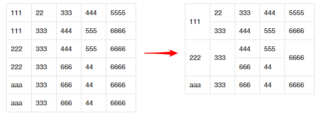
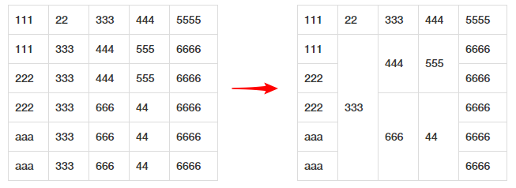

# table-row-span

Automatic rowspan based on the content of the table

### demo
```
open demo.html in browser
```
### rowspan Rules





### jquery
```javascript
 $('#table-merge').PdTableRowSpan()
```

### options
```javascript
 $('#table-merge').PdTableRowSpan({
      tags:'td',// compare tags
      verticalAlign:'middle', //rowspan style 【middle top bottom】
      from:2,// compare start col ,start from 1 
      to:4// compare end col,start from 1
    })
```

### destroy
```javascript
 $('#table-merge').PdTableRowSpan('destroy')
```

### License
This plugin is available under [the MIT license](http://mths.be/mit).

